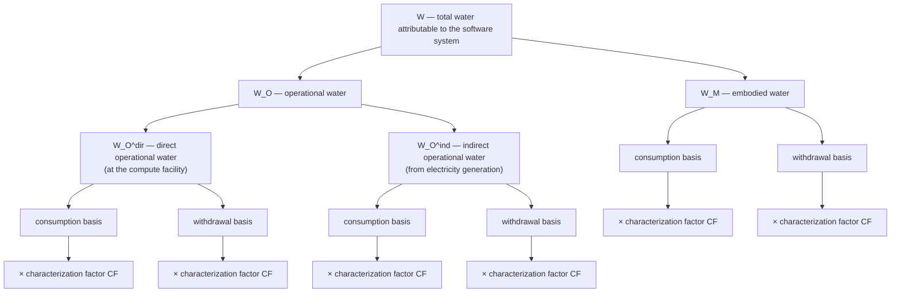

<!--
Grounded in: SWI-Specification.md § Symbols and abbreviated terms, § Methodology summary.
Guideline Requirement 2 (Formula Explanation, Annotated Diagrams, and Visual Aids) —
SWI-Guidelines-Requirements-Analysis.md.
-->

# Formula Walkthrough and Visual Reference

This page is a plain-language, annotated breakdown of every symbol in the
SWI formula and how they fit together. It does not walk through a worked
numeric example — for that, see [Worked Examples](./QuickGuide.md).

## The decomposition, as a tree

Each leaf of this tree is quantified twice — once as a physical volume
(unadjusted) and once weighted by local water stress (stress-adjusted) —
before being divided by the functional unit `R` to produce an SWI value.
This recreates, in diagram form, the decomposition the SSWG worked through
on its shared Miroboard during specification review; it is not a literal
reproduction of that board.

## Every symbol, explained

| Symbol | Plain-language meaning |
| --- | --- |
| `R` | The **functional unit** — what one SWI value is "per": an API call, a user, an AI training run. Everything else in the formula must scale to this same unit. |
| `W` | **Total water** attributable to the software system, before choosing consumption or withdrawal. |
| `W_O` | **Operational water** — water used while the software's infrastructure runs, as opposed to water embodied in building the hardware. |
| `W_M` | **Embodied water** — water used across the hardware's lifecycle: extraction, manufacturing, transport. |
| `W_O^dir` | **Direct operational water** — water used *at* the facility the software runs in (cooling, humidification). |
| `W_O^ind` | **Indirect operational water** — water used *generating the electricity* the software consumes, at the power plant. |
| `E` | **Energy consumed** by the software system, in kWh. Drives both direct (via WUE) and indirect (via EWIF) operational water. |
| `WUE` | **Water Usage Effectiveness** — a facility's water consumption per unit of energy, in L/kWh. One option (not the only one) for estimating `W_O^dir`. |
| `EWIF_b` | **Electricity Water Intensity Factor** — litres of water consumed or withdrawn per kWh generated, for basis `b`. Drives `W_O^ind`. |
| `b` | The **water accounting basis**: `c` for consumption, `w` for withdrawal. Every water quantity is computed for both. |
| `TW_b` | **Total lifecycle water** attributable to a piece of hardware, for basis `b`. |
| `TS` | **Time share** — the fraction of the hardware's expected lifetime reserved for this software. |
| `RS` | **Resource share** — the fraction of the hardware's total resources (e.g. cores, memory) reserved for this software. |
| `TiR`, `EL` | Time reserved for the software, and the hardware's expected operational lifetime — together giving `TS = TiR / EL`. |
| `RR`, `ToR` | Resources reserved for the software, and total resources available — together giving `RS = RR / ToR`. |
| `i` | A **geographic region or watershed** — the place where a specific water use event actually happens. |
| `CF_b,i` | The **characterization factor** for basis `b` in region `i` — a dimensionless multiplier reflecting how water-stressed that region is. |
| `SWI_b` | **Unadjusted SWI** for basis `b` — a physical water volume per functional unit. |
| `SWI_b^adj` | **Stress-adjusted SWI** for basis `b` — the same volumes, weighted by where they happened. |

## The parallel to SCI

Readers coming from the Software Carbon Intensity (SCI) specification will
recognise this shape. SWI follows the same structural pattern (ISO/IEC
21031:2024), decomposed the same way:

| SCI | SWI | Relationship |
| --- | --- | --- |
| `E` (energy) and `I` (grid carbon intensity) | `W_O^dir` and `W_O^ind` (operational water) | Operational carbon is one multiplication (`E × I`); operational water is two parallel calculations — one for the facility itself, one for the electricity behind it — because water, unlike carbon intensity, has a meaningful *direct* component at the facility as well as an *indirect* one at the power plant. |
| `M` (embodied carbon) | `W_M` (embodied water) | Structurally identical: both use a time-share × resource-share allocation of a hardware total across the software sharing that hardware. |
| `R` (functional unit) | `R` (functional unit) | Identical in concept — pick the unit that matches how the software scales. |
| *(no equivalent)* | `CF_b,i` (characterization factor) | SWI's one genuinely new mechanism. Carbon dioxide's climate effect does not depend on where it's emitted; water stress is local, so SWI needs an extra step — stress adjustment — that SCI has no analogue for. |

If you already know SCI, the fastest way to think about SWI is: *the same
`E`/`M`/`R` skeleton, water counted twice (consumption and withdrawal)
instead of once, and a stress-weighting step bolted on because location
matters for water in a way it doesn't for carbon.*

---

Please submit any comments you have [here](https://github.com/Green-Software-Foundation/SWI-guide/issues/new?labels=Guidelines+Feedback&title=Feedback%3A+Formula+Walkthrough).
